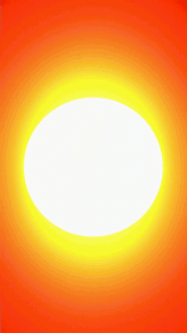
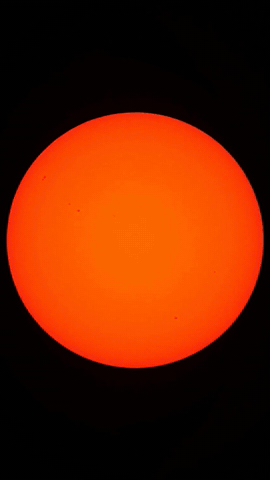

# Eclipse Cleaner

*Clean up and stabilize a shaky solar-eclipse timelapse — and maybe rescue a video you thought was lost.*

**[🇫🇷 Version française](README.fr.md)**

[](https://github.com/bebkill/Eclipse-Cleaner/actions/workflows/ci.yml)
[](LICENSE)
[](https://www.python.org/)
[](https://www.buymeacoffee.com/bebkill)

## The story behind this project

This project began with the capture of the solar eclipse of **August 12, 2026**. My equipment setup was far from ideal — people kept walking in front of my gear — but I still managed to capture the eclipse. Then I opened the video produced by my smart telescope, and my heart sank: it was unusable. Very unstable, with long masked sequences followed by tracking-recovery phases and abrupt brightness adjustments.

I tried to fix it with the tools available (SIRIL and PIPP), but I probably didn't know how to use them well enough — or it was simply too much to ask of them. So I set out to build a tool of my own, with the help of my favorite AI assistant. Here it is.

## Before / after

| Original (straight from the smart telescope) | Cleaned with Eclipse Cleaner |
| :---: | :---: |
|  |  |

*Both clips play at 6× speed.*

## What it does

- **Sorts the frames** — only irreparable frames are rejected: blur, darkness, glare, failed disk localization. A badly framed frame is *not* a defective frame; the stabilizer fixes the position.
- **Locks the solar disk to the center** — a fixed-radius directed Hough vote finds the disk even on a thin crescent, and tolerates clouds masking part of the limb.
- **Moves the frame like a camera operator would** — the crop window is planned, bounded softly against the source edges, and absorbs the tracking re-acquisition jumps (hundreds of pixels in a single frame) instead of jerking.
- **Normalizes exposure — luminance only.** Color is left exactly as filmed: a red solar filter stays red, a sunset stays warm.
- **Bridges short gaps** with linear interpolation, and never invents footage for long ones: a real hole stays a clean cut.
- **A review viewer in your browser** — inspect every frame, overrule the automatic sorting with one keystroke, then re-render. Bilingual (English/French), served on 127.0.0.1 only.

Everything adapts to your video: resolution, aspect ratio, frame rate and apparent solar radius are measured, not assumed, and every threshold can be overridden from the command line.

## Installation

Requires **Python 3.12+** — check with `python --version` first: on a system whose default `python` is older (Homebrew, some Linux distros), the install fails with an unrelated-looking dependency error rather than a clear version message. The ffmpeg binary is bundled through `imageio-ffmpeg`: nothing else to install on your system.

```bash
python -m pip install git+https://github.com/bebkill/Eclipse-Cleaner.git
```

Or from a clone:

```bash
git clone https://github.com/bebkill/Eclipse-Cleaner.git
cd Eclipse-Cleaner
python -m pip install .
```

⚠️ Don't miss the trailing dot in `pip install .` — it means "install from this directory".

Once installed, run the tool with:

```bash
python -m eclipse viewer
```

This form always works. The install also creates a shorter `eclipse-cleaner` command, but it is only found if your Python `Scripts` directory is on the PATH — on Windows it often isn't. If your terminal answers *"'eclipse-cleaner' is not recognized…"*, nothing is broken: just use `python -m eclipse` instead. (An install through `pipx install git+https://github.com/bebkill/Eclipse-Cleaner.git` sets up the PATH for you, if you prefer the short command.)

## Usage

### The easy way: the viewer (recommended)

```bash
python -m eclipse viewer
```

This opens a local page in your browser. Click **Browse…** to pick your video, then run the three steps from the page:

1. **Extract the thumbnails** (for review);
2. **Analyze the frames** (measurements and automatic verdicts);
3. **Produce the final video** → written next to your source as `<source>-clean.mp4` (optionally with a numbered PNG sequence).

Between steps 2 and 3, **review the sorting**: the timeline shows kept frames in green, rejected ones in red, your own overrides in blue. Press `k` on any frame to keep or discard it — each change is saved immediately, and the render applies your decisions automatically.

| Key | Effect |
|---|---|
| `space` | Play / pause |
| `←` `→`, `n` / `p` | Previous / next frame in the current selection |
| `k` | Toggle keep / discard on the current frame |
| `r` | Filter: kept frames only |
| `e` | Filter: rejected frames only |
| `m` | Filter: my overrides only |
| `+` / `-` | Zoom the thumbnail strip |

Progress bars, cancellation, and task state all live server-side: closing the tab loses nothing.

### The command-line way

```bash
python -m eclipse run input.mp4 output.mp4
```

Or in two steps, so you can re-render with different thresholds without re-analyzing:

```bash
python -m eclipse analyze input.mp4 --cache analysis.json
python -m eclipse render input.mp4 output.mp4 --cache analysis.json --blur-rel 0.35
```

### Main options

The CLI flags are in French (see [Known limitations](#known-limitations)); here is what they mean:

| Flag | Meaning |
|---|---|
| `--processus N` | Number of worker processes (default: logical cores − 1; `1` = sequential) |
| `--radius R` | Apparent solar radius in pixels, if automatic estimation fails |
| `--taille WxH` | Crop-window size (default: 7/9 of the source, same aspect ratio) |
| `--sortie-taille WxH` | Encoded output size (default: same as the source) |
| `--tolerance-bord PX` | How much the disk may be clipped by the source edge before rejection (default 5) |
| `--depassement-butee PX` | How far the window may overshoot the source edges, filled by edge replication (default 400) |
| `--interp-max N` | Longest gap (in frames) bridged by interpolation (default 3, `0` disables) |
| `--interp-deplacement-max PX` | Largest window displacement across a bridged gap (default 30) |
| `--seuil-masque F` | Minimum fraction of the light the solar mask must capture for a center measurement to be trusted (default 0.80) |
| `--dark-rel`, `--dark-abs`, `--blur-rel`, `--flare-rel`, `--conf-min`, `--ilot-min` | Sorting thresholds (darkness, blur, glare, localization confidence, minimal kept-run length) |
| `--decisions FILE` / `--sans-decisions` | Use a specific manual-review file / ignore manual reviews entirely |

## Known limitations

- **Command-line messages are in French** (the viewer itself is fully bilingual). Internationalizing the CLI is a welcome contribution.
- **Clipped highlights cannot be reconstructed** — exposure is re-leveled, but detail lost to saturation stays lost.
- **Two color renditions can coexist in one film** if a solar filter was removed mid-sequence. That is what really happened in front of the camera, so it is kept, like cloud crossings.
- The viewer's **Browse…** dialog needs a graphical session (it uses the system file dialog via `tkinter`). On a headless machine, pass the video path on the command line instead.
- The test suite is developed on **Windows**; four Windows-specific tests skip themselves automatically on Linux/macOS.

## Tests

```bash
python -m pip install -e ".[dev]"
python -m pytest
```

Assertions run against synthetic frames with known ground truth; no real video is required.

## Share your results — and support the project

This program saved my video, and I hope it can help other eclipse chasers in the same situation. Don't hesitate to share your results, comments, and suggestions for improving this humble program — [issues](https://github.com/bebkill/Eclipse-Cleaner/issues) and pull requests are very welcome.

And if, like me, it rescued your eclipse video, you can support the project:

<a href="https://www.buymeacoffee.com/bebkill"></a>

## License

[MIT](LICENSE) — free to use, modify, and share.

Clear skies! 🌘
